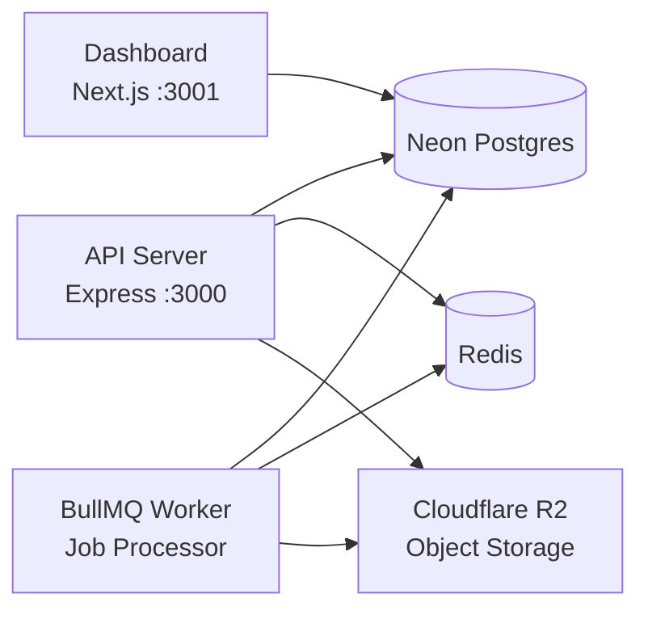

# ExportKit — Portfolio Showcase

> **Note:** This is a curated portfolio showcase. Implementation details have been redacted. For the full codebase, please contact me directly.
>

## Sample Screenshots (Subject to change)

## Overview

Production-ready data export API for SaaS teams. Drop-in CSV, JSON, and Excel exports with progress tracking, webhook delivery, and email notifications.

## Architecture

## Tech Stack

| Layer | Technology |
|-------|-----------|
| Runtime | Node.js 20+, TypeScript 5.3+, ESM |
| API | Express 4, Zod, Helmet |
| Database | Prisma ORM, Neon Postgres |
| Queue | BullMQ, Redis |
| Storage | Cloudflare R2 |
| Email | Resend + React Email |
| Excel | ExcelJS streaming |
| Billing | Stripe |
| Dashboard | Next.js 15, NextAuth, Tailwind |
| Testing | Vitest, fast-check |

## Key Decisions

| Decision | Rationale |
|----------|-----------|
| BullMQ over SQS | Self-hosted Redis, more control |
| R2 over S3 | 90% cheaper egress |
| Cursor-based streaming | Memory-safe for any dataset size |
| ExcelJS WorkbookWriter | Streaming prevents OOM |
| Circuit breaker middleware | Prevents cascade failures |

## License

MIT

---

*Service implementations, route handlers, and component internals have been redacted.*
